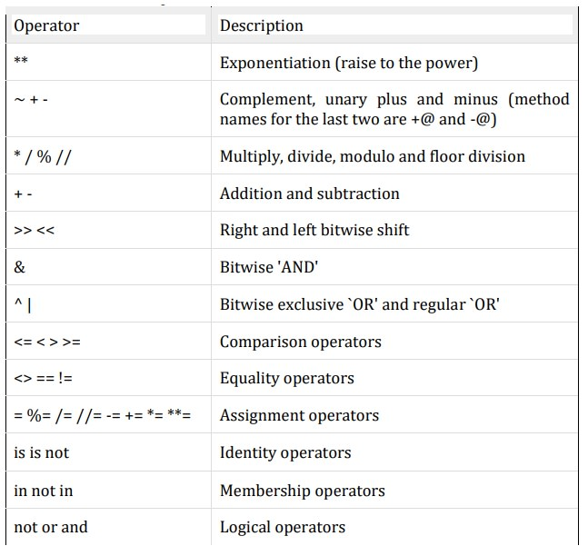
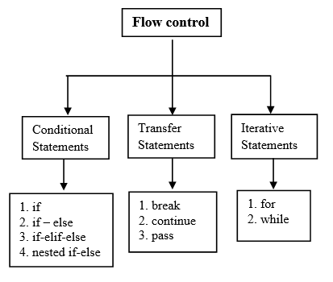

# By Dr. Rahul Dubey (HOD- CSE | SISTec)
# Assistant Prof: Amit Swami Sir 
# Notes - Abhinav Singh
## Table of Contents

1. [Variables](#variables)
2. [Data Types](#data-types)
3. [Operatos](#operators)
4. [Input and Output](#input-and-output)
5. [Flow Control](#flow-control)
6. [String](#day-4)
# Day 1
History and basic of python
# Day 2
# Variables
1. Only alphabets and digits
2. only one special symbol ' _ '
3. identifiers are case sensitive
4. keywords not allowed
5. no limit


# Data Types
## Fundamental Datatypes
int, float, complex, bool, str
## Advanced Datatype
tuples, list, dictionary, set, frozen, range, None

## Notes
[Anaconda Download](https://www.anaconda.com/download)
> **id** is a funtion which returns address of the variable and **type** is a function which return the type of variable

>**typeconvert** and **typecoersion** are the same thing.

> In python, everything is object!
```
x=5 
print(type(x))
 ```

> Reusability concept is used in Python.
```
x=5
y=5
print(id(x))
print(id(y))
```

> Python also uses immutability after 2^8
```
x=257
y=257
print(id(x))
print(id(y))
```

### Datatypes of binary, octa and hexa: 
```
x=0b101
y=0o753
z=0xA123
print(x,y,z)
print(bin(x),oct(y),hex(z))
```

You can use various format of integer in real part of complex numbers
```
x=0b101+2.5j
print(x)
```

### Bool DataType
```
x=True
y=False
print(x+y)
```
In python *true* is **1** and *false* is **0** so performing arithmetic function on bool will convert it in number.

---
### String
> Note: There is no word like **character** in python.

```
x='R'
print(x)
```
Python don't have anything like pointer but everything works on pointer only!

```
x='Rahul';
for i in x:
    print(id(i))

#Console:
# Prints many address.    
```
---
### Type Casting or Type Coersion

```
x=3.5
y=int(x)
print(y)
```

```
x="10.5"
y=int(x)
print(y)

#Console:
# Literal Error/ Value Error Here
```
```
x="10"
y=int(x)
print(y)

#Console:
# No Literal Error/ Value Error Here
```

>In python if there is **0** only, boolean will return ***false*** otherwise ***true*** for everything !
```
x=.25   #True
y=""    #False
z=-1    #True
a=" "   #True
```
---
### Concept of Immutability

```
x=5
print(id(x))
x=10
print(id(x))
```

``All the fundamental datatypes support immutability``

---
### Range

Range is a class in python and it's constructor is used to make range between two numbers. It is an advanced datatype!

```
x=range(1,10)
print(type(x))
print(list(x))

#Console:
#<class 'range'>
#[1, 2, 3, 4, 5, 6, 7, 8, 9]
```
```
x=None
print(type(x))

#Console:
#<class 'NoneType'>
```

```
x=None
x=5
print(x)

#Console:
#5
```
## Advanced DataTypes

### List
* List is container type of data type which contain **homo** or **non homogenious** data.
* It preserves the order of insertion and
* It support indexing
* It supports slicing
* It has a  growing nature means it is mutable.
```
l=[]
print(type(l))

#Console:
#class <list>
```

```
list1=[1,2,3,4,[5,6,7,['a','b']],{'name':'abhinav'}]
print((list1))

#Console:
#[1, 2, 3, 4, [5, 6, 7, ['a', 'b']], {'name': 'abhinav'}]
```

> In Python, indexing always starts with **0**.

```
list1=[1,2,3,4,[5,6,7,['a','b','c']],{'name':'abhinav'}]

print(list1[4][3][2])

#Console
#c
```
---
### Tuple
* It is a immutable list.
```
l=[1,2,3,4]
l.append(5)
print(l)

# [1, 2, 3, 4, 5]

t=(1,2,3,4)
t.append(5)
print(t)

# Cannot append Error Attribute Error
```
``If a tupple has only one integer, it should be separated be commma , ``
```
l=[]
print(type(l))  # <class 'list'>
t=()
print(type(t))  # <class 'tuple'>
t=(1)
print(type(t))  # <class 'int'>
t=(1,)
print(type(t))  # <class 'tuple'>
```

``Mutability is changing of data on the same address as previous``
>Tuple is mutable using new memory address
```
t=(1,2,3,4)
t1=(5,6)
print(id(t))
t=t+t1
print(t)
print(id(t))

# 2625484955360
# (1, 2, 3, 4, 5, 6)
# 2625482882688
```
---
### Dictionary & Set
* Key value pair
* Mutuable datatype
```
dict={'key':'value'}
```

```
dict={'key':'value'}
d={}
print(type(d))

q=set()
print(type(q))
q={1,2,3,4,5}

#<class 'dict'>
#<class 'set'> 
```
```
d={'1':'Abhinav Singh'}
a={(1,2,3,4):'Abhinav'}
print(a)
```

```
d={'1':'Abhinav Singh'}
a={(1,2,3,4):'Abhinav'}
print(a.keys())
print(a.values())
print(a.items())
```

```
d={'data':[1,2,3,4],'name':'Abhinav','age':20}
for keys,value in d.items():
    print(keys,value)

#data [1, 2, 3, 4]
#name Abhinav
#age 20
```

# Day-3

# Operators
1. Arithmetic
2. Relational or Comparision
3. Logical
4. Bitwise
5. Assignment
6. Special Operator

### Arithmetic
1. Addition (+)
2. Subtraction(-)
3. Division(/)
4. Multiplication(*)
5. Modulus(%)
6. #### Floor Division Operator
```
a=5
b=2
c=a//b
print(c)
```
If any number is *float* and we are doing floor division then the result is also a *float* number
```
a=5.0
b=2
c=a//b
print(c)
```
7. #### Power Operator/ Exponential operator
```
a=3
b=a**2
print(b)
```


---
### Relational Operator
1. Greater Than
2. Less Than
3. Equal
4. Greater equal to
5. Less equal to

>Only equal to operator does not take care of datatype, otherwise there will be a ***TypeError***
```
print(10>"abhi")

#TypeError
```
---
### Logical Operators
1. and
2. or
3. not

#### AND
If we are working with integer, first part is ***false*** or ***0*** means it is evaluated as ***false*** the output is the ***right*** part 
#### OR
If we are working with integer, first part is ***true*** or ***1*** means it is evaluated as ***true*** the output is the ***left*** part 

>x and y <br>
>If x is evaluated as ***false*** return x, otherwise return >y as the answer.

>x or y<br>
>If x is evaluted as ***True***, return x as the answer

``The python virtual machine always returns a string in single quotes '' ``

>**Zero Division Error** : when anything is divided by 0.
---
### Bitwise Operator
&, /, >>, <<

### Assignment operator
1. Normal Assignment
```
x=10
```
2. Compound Assignment
```
x+=10
```
``In  python, there is no ternary operator !``

### Special Operators
1. **Identity operators** (is and is not). Mainly for address com.
```
a=10
b=10
print(a is b)
print(a is not b)
```
2. **Membership** (in and not in to check membership)
```
s="abhinav"
print('b' in s)
```
```
d={1:'abhinav',2:"singh"}
print(2 in d)
print("abhinav" in d.values())
```
### Operator Precedence Image


# Input and Output
### Input
```
x=input("Enter data: ")
print(x)
```

Multiple Input in python can be done using ***split*** method.

`` Split function returns the list of character``

```
x=input("Enter data: ")
l=x.split(',')
print(type(l))
sum=0 
for i in l:
    sum+=int(i)
print(sum)
```
#### List Comprehension
```
x=[int(i) for i in input("Enter data: ").split(',')]
```
---
### Command Line Arguments
sys is built-in module in python which contain a variable that is argv
```
print(type(argv))
```

#### Unpacking
```
a,b=input("Enter data").split(',')
```

### Separator attribute
```

print("abhinav","Singh",sep=",")

print("Abhinav",end=' ')
print("Singh")
```

### Print Formatted String
```
a,b,c,d=10,11.5,"Abhinav",{1:"Singh"}
print("It is an integer %i or %d"%(a,a))
print("It is an float %f"%(b))
print("It is an string %s"%(c))
print("It is an string %s"%(d))
```

### Format Method (f-string)
```
a="Abhinav"
b="Singh"
print("{0} and {1}".format(a,b))
print(f"{a} and {b}")
```
# Day-4
# **Flow Control**

>The Flow of a program is always sequential
---
### Conditional Statements
1. if
2. if-elif
3. if-elif-else
```
a=input("enter designation: ")
if a=="engineer":
    print("Hello Boss !")
    
elif a=="friend":
    print("Mera Bhai hai tu")
else:
    print("Good Morning")
```

`` There is no pre-increment and post-increment``

---
### Iterative Statements
#### 1. FOR
```
l=[1,2,3,4,5]
sum=0
for _ in l:
    print(_)
for _ in range(len(l)):
    sum+=l[_]
print("Sum is :",sum)
```
#### 2. WHILE 
```
inp=int(input("Enter any number: "))
i=0
while i<inp:
    print("The value of i",i)
    i+=1
```
---
### Transfer Statements
#### 1. Break
```
for i in range(10):
    if i==5:
        print("Reached 5")
        break
    print(i)
```
#### 2. Continue
```
for i in range(10):
    if i==5:
        print("Reached 5")
        continue
    print(i)
```

#### 3. Pass
```
for i in range(10):
    pass
```

#### For Else
```
cart=[10,20,30,40,100]
for item in cart:
    if item>400:
        print("we cannot process your order")
        break
else:
    print("all orders will be delivered!")
```
#### While Else
```
cart=[10,20,30,40,100]
i=0
while i<len(cart):
    if cart[i]>40:
        print("Your order can not be processed!")
        break
    i+=1
else:
    print("Order will be delivered !")
```
# Day 5
## String
String is immutable<br>
String supports indexing<br>
String support slicing


```
s1="abhinav"
s2="Singh"
print(s1+s2)
```
```
s1="abhinav"
s2="Singh"
print(s1+s2*2)
```
#### Slicing
Slicing is in 2 direction<br>
Forward Direction<br>
Back Direction

``There is no exception in slicing whether the end is given out of bound``

```
s ="Learning Python is very very easy!!!"
print(len(s))
print(s[1:7:1])
print(s[:7])
print(s[7:])
print(s[7:10000000000000000000000000])
print(s[::])
print(s[:])

s='abcdefghij'
print(s[1:6:2])
print(s[::1])
print(s[::-1])
print(s[3:7:-1])
print(s[7:4:-1])
print(s[0:10000:1])

```
---
### How to remove the space of string
#### Strip Function
1. .strip()
2. .lstrip()
3. .rstrip()

``In string there are some functions that are inplace and some are outplace``

```
x=input()
print(x)
removed=x.strip()
print(removed)
```
#### Finding sub string
1. find 
```
l="learning python is easy"
print(l.find("python"))
```
```
l="learning python is easy"
print(l.find("python")+len("python")-1)
```
>Find function returns **-1** if the sub string is not found!
```
l="learning python is easy"
print(l.find("python")+len("python")-1)
print(l.find("abhinav"))
print(l.find("abhinav",0,5))
```
2. index (value error exception)
```
l="learning python is easy"
print(l.find("python")+len("python")-1)
print(l.find("abhinav"))
print(l.find("abhinav",0,5))
print(l.index("python",0,5))
```

#### Replace Function
```
s="learning python is every easy"
print(s.replace("pyhton","html"))
```

#### Join function (Most Important method)
The container should be always the collection of string.
```
l=[1,2,3,4,5]
n=len(l)
print(l[n-1])
for i in l:
    if i==l[n-1]:
        print(i)
    else:
        print(i,end=",")
```

```
l=['1','2']
sep=",".join(l)
print(sep)
```

```
#Write a program to remove duplicate element from list
inp=input("Enter the data ").split()
l1=[]
for i in inp:
    if i not in l1:
        l1.append(i)

print(l1)

```

### Case Changing Methods
1. upper()To convert all characters to upper case<br>
2. lower()  To convert all characters to lower case<br>
3. swapcase()  Converts all lower case characters to upper case and all upper case
characters to lower case<br>
4. title()  To convert all character to title case. i.e first character in every word should
be upper case and all remaining characters should be in lower case.<br>
5. capitalize()  Only first character will be converted to upper case and all remaining
characters can be converted to lower case
6. isalnum(): Returns True if all characters are alphanumeric( a to z , A to Z ,0 to9 )
7. isalpha(): Returns True if all characters are only alphabet symbols(a to z,A to Z)
8. isdigit(): Returns True if all characters are digits only( 0 to 9)
9. islower(): Returns True if all characters are lower case alphabet symbols
10. isupper(): Returns True if all characters are upper case aplhabet symbols
11. istitle(): Returns True if string is in title case
12. isspace(): Returns True if string contains only spaces

Program to reverse the string
```
s=input("enter string ")
print(s[::-1])
print("".join(reversed(s)))
```
 
Program to reverse the sentence
```
inp=input("Enter string ").split()
print(" ".join(reversed(inp)))
```
Reverse the words in string
```
inp=input("Enter string ").split()
for i in inp:
    print(i[::-1],end=" ")
```
Reverse even words: 
```
l=input("Enter string ").split()
l1=[]
i=0
while (i<len(l)):
    if i%2==0:
        l1.append(l[i][::-1])
    else:
        l1.append(l[i])
    i+=1
print(" ".join(l1))
```

If **input= a4k3b2** then **Output: aeknbd** :

```
inp=input("Enter string ")
i=0
s=''
for x in inp:
    if x.isalpha():
        s+=x
        previous=ord(x)
        
    if x.isdigit():
        s+=chr(previous+int(x))


print(s)
```

If **input= a1bc2d3** then **Output: abcd123** :
```
inp=input("Enter string ")
i=0
s=''
c=''
for x in inp:
    if x.isalpha():
        s+=x
        previous=ord(x)
        
    if x.isdigit():
        c+=x

s+=c;
print(s)
```
**Input= ABCDABBBCCCDDDFFF <br>
Output= ABCD**
```
s=input("enter string")
a=''
for i in s:
    if i not in a:
        a+=i
print(a)
```
**Input=e4d1<br>
output=de14**
```
inp=input("Enter string ")
l1=[]
l2=[]
for i in inp:
    if i.isalpha():
        l1.append(ord(i))
    else:
        l2.append(ord(i))    
l1=sorted(l1)
l2=sorted(l2)

final=l1+l2
st=''
for i in final:
    st+=chr(i)
print(st)
```

**Input: AABCDD<br>
Output: A-2,B-1,C-1,D-2**
```
s=input("Enter the input data bro:")
d={}
for i in s:
    # d[i]=d.get(i,0)+1
    if(i in d.keys()):
        d[i]+=1
    else:
        d[i]=1
# print(d)

for i,j in d.items():
    if(i!=list(d.keys())[-1]):
        print("{}-{}".format(i,j),end=",")
    else:
        print("{}-{}".format(i,j),end="")
```


```
s = input("Enter the data : ")
d = {}
l = []
for x in s:
    if x in d.keys():
        d[x]=d[x]+1
    else:
        d[x]=1
for k,v in d.items():
    temp = "{}--{}".format(k,v)
    l.append(temp)

print(",".join(l))
```

**Tuple Comprehension in list in loop**
```
s=[(1,2),(3,4),(4,5)]
for k,v in s:
    print(k,v)
```
**Formatting of dictionary with string format method**

```
person={"name":"Abhinav","age":20}
print(f"hello {person['name']}, your age is {person['age']}")
print("hello {name}, your age is {age}".format(**person))
```

```
lst=eval(input("enter the list"))
print(lst)
print(type(lst))
```

#### How to create list with **List** Function

#### **len function**
```
l=list(range(0,10,2))
print(len(l))
print(l[-1])
```

#### **count function**
```
l=[1,1,1,1,1,2,2,2,3,3]
print(l.count(2))
```
---
### Manipulation of list
#### append function
add item at the end of the list

```
l=[1,1,1,1,1,2,2,2,3,3]
l.append("abhinav")
print(l)
```

#### insert function
insert item at a specific function
```
l=[1,1,1,1,1,2,2,2,3,3]
l.insert(2,88)
print(l)
```

#### extend function
```
l=[1,2,3]
l1=['rahul','dubey']
l2=l+l1
l2.extend(l)
print(l2)
```

#### Pop Function
```
l=[1,2,3]
l.pop()
print(l)
```

```
l=[1,2,3]
print(l.pop(1))
```
### Ordering of list data
1. reverse()

```
l=[1,2,3]
l.reverse()
print(l.reverse())# print none because it works inplace
print(l)
```

2. sort()
```
l=[2,5,7,1,6,4]
l.sort()
print(l)
print(l.sort())# prints none, return nothing, works inplace
``````

```
l=['abhinav','singh','aastha']
l.sort()
print(l)#prints sorted list
l=['abhinav','singh','aastha',1,2,3]
l.sort()
print(l) # error because string can't be compare with int
```

By defualt, sort use ascending order <br>

**Descending Order**

```
l=['abhinav','singh','aastha']
l.sort(reverse=True)
print(l)
```

3. Aliasing and Copy

```
x=[1,2,3,4]
y=x
print(id(x))
print(id(y))
y=x[:]
print(id(x))
print(id(y))
```

```
x=[1,2,3,4]
y=x
y.append(5)# it is changing the x also, so it is pointing to data of x only
print(x)
print(id(x))
print(id(y))
y=x[:]
print(id(x))
print(id(y))
```
```
x=[1,2,3,4]
y=x*3
print(y)
```

4. Clear()
```
x=[1,2,3,4]
print(x)
x.clear()
print(x)
```
---
#### List Comprehension 
```
x=[int(i) for i in input("Enter data: ").split()]
print(x)
```
**Squaring of number in list**
```
n=int(input("Enter any number: "))
l=[i*i for i in range(n)]
print(l)
```

write a program to print unique vowels in given string


```

st=input('Enter string: ')
st=st.lower()
vowels='aeiou'
l=''
for i in st:
    if i in vowels:
        if i not in l:
            l+=i

print(l)
```

Given a list of numbers, return a list where all adjacent equal elements have been reduced to a single element, so [1, 2, 2, 3] returns [1, 2, 3]. You may create a new list or modify the passed in list.
```
list=eval(input("Enter list "))
print(list)
li=[]
for i in list:
    if len(li)>0:
        if i!=li[-1]:
            li.append(i)
    if len(li)<1:
        li.append(i)

print(li)
```
Selection Sort

```
arr = [64, 25, 12, 22, 11]
n = len(arr)    
for i in range(n - 1):
    min_index = i
    
    for j in range(i + 1, n):
        if arr[j] < arr[min_index]:
            min_index = j
    
    arr[i], arr[min_index] = arr[min_index], arr[i]


print(arr)
```
Given two lists sorted in increasing order, create and return a merged list of all the elements in sorted order
```
list1=eval(input("Enter list 1 "))
list2=eval(input("Enter list 1 "))
list1=sorted(list1)
list2=sorted(list2)
list1.extend(list2)
print(list1)
list1=sorted(list1)
print(list1)
```

Write a program which can generate and print a tuple, where the values are the squares of number between 1 and 20 (both included)
```
tup=tuple(i*i for i in range(1,21))
print(tup)
```

Write a program to compare two tuple whether they contain same element or not
```
tup1=(1,3,5)
tup2=(5,3,1)
if len(tup1)!=len(tup2):
    print("Does not contain same element !")
else:
    for i in tup1:
        if i not in tup2:
            print("They does not contain same element")
            break
    else:
        print("They contain same element")
        
```

### Tuple
Tuple Packing
```
a=1,2,3,4
print(a)
```
Tuple can be converted to list and vice versa.
```
t=(1,2,4,5)
l=list(t)
print(l)
```

### Tuple Comprehension
There is no word like **Tuple Comprehension**
```
t=(i**2 for i in range(1,10))
print(t)
print(type(t))

#<generator object <genexpr> at 0x000001D7428E9220>
# <class 'generator'>
```

### Dictionary
* Dictionary is the key value pair representation
* duplicates keys are not allowed but values are allowed
* hetrogenous objects are allowed for both keys and values
* insertion order is not preserved in dictionary
* dictionaries are mutuable in nature
* indexing and slicing are not applicable on dictionary
* in cpp and java, dictionaries is known as maps

#### del()
#### get()
It returns the value but if they key is not present it return None

```
rec={'name':'abhinav','age':20}
print(rec.get('name'))
print(rec.get('f'))
print(rec.get('f','unkown'))
rec.pop('name')
print(rec)
```

#### setdefault()


```
rec={'name':'abhinav','age':20}
rec.setdefault('name','arpit')
rec.setdefault('sname  ','singh')
print(rec)
```

### Dictionary Comprehension
```
rec={x:x**2 for x in range(10)}
print(rec)
```
# Day 7 (16/8/23)
Sum of values in Dictionary
```
inp=eval(input("enter the "))
print(type(inp))
sum=0
for i in inp.values():
    sum+=i

print(sum)

```

wap to accept name and marks from the keybpard and create the dictionary
```
dict={}
while True:
    nme=input('Enter the name: ')
    if nme=='E':
        break
    marks=int(input('Enter the marks '))
    dict.setdefault(nme,marks)

while True:
    name=input("enter the name to check ")
    if name=='E':
        break
    print(dict[name])

```


```
s = list(range(11, 1000))
count = 0

for i in s:
    if i % 2 == 0:
        continue
    else:
        check = True
        digits_seen = set()
        
        for j in str(i):
            if j in digits_seen:
                check = False
                break
            digits_seen.add(j)
        
        if check:
            # print(i)
            count += 1

print(count)
```


### Set
* Set only contains unique value
* Insertion order is not preserved.
* can sort the set
* Indexing and slicing are not allowed
* Set objects are mutable

---
```
s={1,2,3,4}
print(type(s))
a={}
print(type(a))
a=set()
print(type(a))
```

#### Add()
add the elements in set
```
s={1,2,3,4}
print(type(s))
s.add(40)
print(s)
```
#### union() & intersion()
```
x={1,2,3}
y={6,7,8}
print(x.union(y))
print(x.intersection(y))
```
---
### Set Comprehension
```
x={x*x for x in range(5)}
print(x)
```
Unique vowels in a word
```
inp=input("Enter word")
vowel={'a','e','i','o','u'}
x=set(inp)
print(x.intersection(vowel))

```
Frozen Set are not mutable
```
inp=input("Enter word")
vowel={'a','e','i','o','u'}
x=frozenset(inp)
# x.add('u')
print(x.intersection(vowel))

```

## Functions

* Function is a block of code
* Used for reuability
* Function is of 2 types: 
    1. User Defined
    2. built-in
* mandatory keywords:
    * def keyword
    * return keyword(optional)


```
def funName(para):
    """ This is a function"""


funName(5) #function calling
print(type(funName))
print(funName)

```

```
def hello():
    print("hello")

hello()
```
```
def hello():
    print("hello")

print(hello())
print(hello)
```

Function to add two numbers
```
def add(a,b):
    return a+b

print(add(5,6))
```

``In Python, parameter and arguments are same but passing parameter at function calling is **actual argument** and function accepting it is known as **formal argument**``

```
def calc(x,y):
    return x+y, x-y, x*y, x/y


print(calc(1,2))
print(type(calc(1,2)))
```

Write a function to find the maximum and minimum numbers from a sequence of numbers.
```
list=[1,5,9,4,2]
def minMax(para):
    para.sort()
    return min(para) ,max(list)

print(minMax(list))
```

Write a function to generate Fibonacci series for the number input by user. (note implement without recursion)

```
def fibonacci(n):
    list=[1]
    prev=0
    now=1
    for i in range(n):
        list.append(prev+now)
        temp=now
        now=prev+now
        prev=temp
        
    print(list)


fibonacci(6)
```

Write a function which takes a tuple of integer’s values and return a dictionary who’s each item is a pair of integer’s values and its frequency.
```
tup=(1,2,3,4,5,1,2,1)

def freq(tup):
    dict={}
    for i in tup:
        if i in dict.keys():
            dict[i]=dict[i]+1
        else:
            dict.setdefault(i,1)

    return dict


print(freq(tup))
```


## Types of arguments
#### 1. postional
```
def wish(name,msg):
    print(f"hello {name}, {msg}")

wish("Abhinav","Jai shree ram")# positional
```
#### 2. default

```
def wish(msg,name='rahul'):
    print(f"hello {name}, {msg}")

wish(msg="hello")
```
`` Default argument should be used last``

#### 3. variable 
```
def wish(name,msg):
    print(f"hello {name}, {msg}")

wish(msg="Jai shree ram",name="Abhinav")# keyword argument
```
